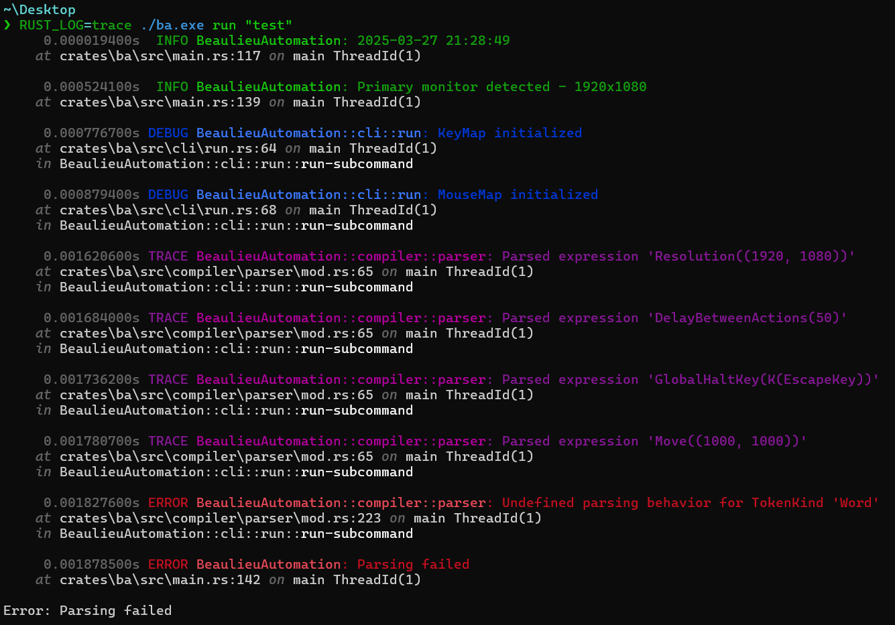
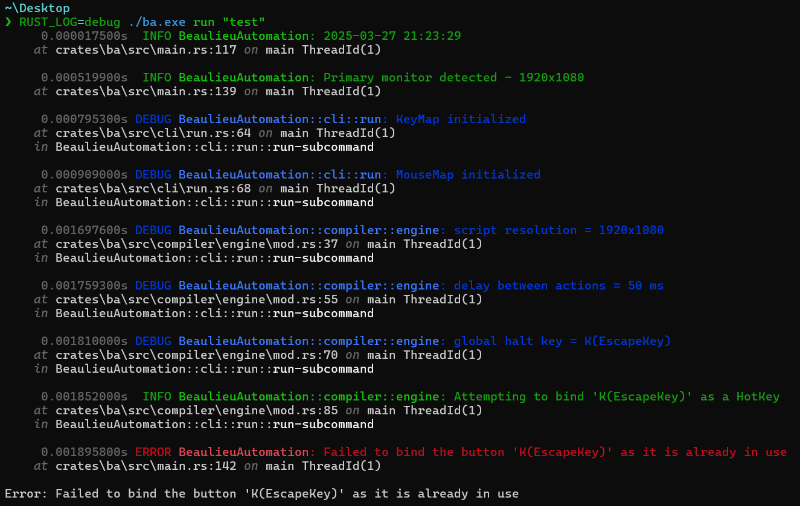
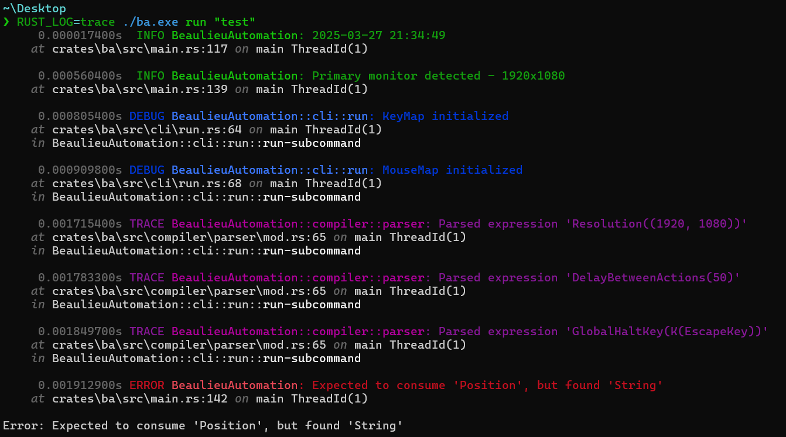
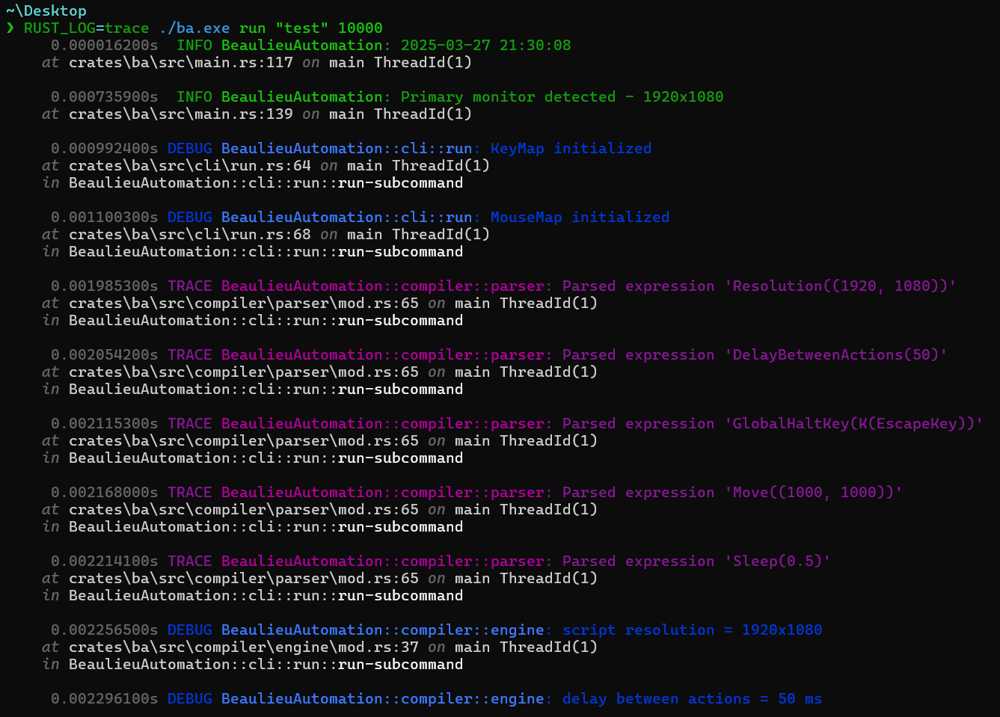
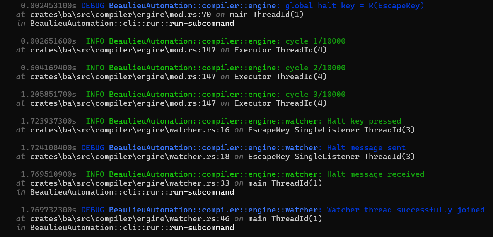

---

A lightweight, fast, and feature-rich interpreter with ahead-of-time compilation for a custom scripting language designed to automate repetitive manual user input tasks on Windows. Written in Rust, it prioritizes failsafe guarantees, detailed logging, and reliable execution.

## Features

* Beautiful logging using the tracing crate
* Automatic scaling of scripts to active monitor
* Hotkey creation
* Robust failsafes: global halt key, `await` expression
* Simple portable executable
* Real key press and mouse movement emulation (bypassing restrictions in most applications, except for the Type expression, which uses virtual key packets)
* Scripts are fully parsed and checked for errors before execution.

## Table of Contents

- [Installation](#Installation)
- [Usage](#Usage)
- [Detailed Usage and Examples](#detailed-usage-and-examples)
- [Logging](#logging)

## Installation

Beaulieu Automation is designed as a standalone portable executable. You can either:
* download a [pre-compiled binary](https://github.com/anesthetice/Beaulieu-Automation/releases)
* build it from source:
  ``` bash
  git clone https://github.com/anesthetice/Beaulieu-Automation.git
  cd Beaulieu-Automation
  cargo build --release
  ```

## Usage

> [!IMPORTANT]
> BA is currently configured for the `Swiss French` keyboard layout. If you need to use a different layout, modify the following sections accordingly:
> 1. Update [main.rs](crates/ba/src/main.rs) to match your desired keyboard layout. Refer to this [documentation](https://learn.microsoft.com/en-us/windows/win32/api/winuser/nf-winuser-getkeyboardlayoutnamea) for more details.
>   ``` rust
>      // check keyboard layout
>      let mut pwszklid = [0_u8; 9];
>      unsafe {
>          GetKeyboardLayoutNameA(&mut pwszklid).context("Failed to get keyboard layout")?;
>      }
>      let keyboard_layout = CStr::from_bytes_with_nul(&pwszklid)?.to_str()?;
>      if keyboard_layout != "0000100C" {
>          tracing::error!(
>              "Expected '0000100C' for keyboard layout, got '{}'",
>              keyboard_layout
>          );
>          Err(anyhow::anyhow!(
>              "Invalid keyboard layout, switch to Swiss-French"
>          ))?
>      }
>   ```
> 2. Modify the relevant keycodes in [input.rs](crates/input-bot/src/windows/inputs.rs) to support your preferred keyboard layout.
>   ``` rust
>   impl From<KeybdKey> for u64 {
>      // https://docs.microsoft.com/en-us/windows/win32/inputdev/virtual-key-codes?redirectedfrom=MSDN
>      // modified for swiss-french keyboard
>      fn from(key: KeybdKey) -> u64 {
>          match key {
>              BackspaceKey => 0x08,
>              TabKey => 0x09,
>              EnterKey => 0x0D,
>              EscapeKey => 0x1B,
>              ...
>              // <
>              OEM102 => 0xE2,
>              OtherKey(code) => code,
>          }
>      }
>   }  
>   ```

### Commands

Beaulieu Automation provides two simple commands:
```
Usage: BeaulieuAutomation.exe [COMMAND]

Commands:
  new   Create a new BA application
  run   Runs the specified BA application
  help  Print this message or the help of the given subcommand(s)

Options:
  -h, --help     Print help
  -V, --version  Print version
```

**Creating a new application (`new`)**:
```
Usage: BeaulieuAutomation.exe new <path>

Arguments:
  <path>
          path/name of the new application
          e.g. 'new test' will create a new application named test in the terminal's current working directory
```

**Running an application (`run`)**:
```
Usage: BeaulieuAutomation.exe run <path> [repetitions]

Arguments:
  <path>
          path of the application folder

  [repetitions]
          number of times to repeat the script
```

## Detailed Usage and Examples

> [!NOTE]
> For brevity, we assume the executable is named `ba.exe` in the following examples.

### Creating a New BA Application

To initialize a new BA application named `test`:
```
.\ba.exe new test
```

This will generate a new folder named `test` in the current working directory. It contains the following files:

1. **`main.ba`** – The core BA script file.
2. **`keymap.json`** – Maps human-readable key names to valid key identifiers.
3. **`mousemap.json`** – Maps mouse button names to their respective identifiers.
4. **`README.md`** – A template README for documenting your application.

Let's go through each file in detail:

### `README.md`
This file is meant to document the purpose and requirements of your BA application.
``` md
## Title

### description
* describe what your application is used for here

### layout
* describe your desktop's initial layout for the application to function properly
* please also include a screenshot of the entire initial desktop in the application folder
```

### `keymap.json` and `mousemap.json`
These files contain mappings between script names and actual key or button identifiers. Example from `keymap.json`:
```json
[
  ["escape", "EscapeKey"], // 'escape' can be used in the script to refer to the EscapeKey
  ["esc", "EscapeKey"]     //  so can 'esc', however using 'EscapeKey' would not work
]
```
> [!IMPORTANT]  
> In the script file, keys/buttons can take any capitalization, however the script names defined in the `*map.json` files must be in lowercase.

### `main.ba`
This is the primary script file. By default, it looks like this:
```
// Resolution of the primary monitor for which this script was created
// DO NOT MODIFY
define RESOLUTION = 1920, 1080

// The standard delay between actions given in milliseconds
define DELAY_BETWEEN_ACTIONS = 50

// The button used to stop the application if required
define GLOBAL_HALT_KEY = Esc
```

### Available expressions

The following commands are available in BA scripts:
```
Move [int], [int]      // Moves the mouse cursor to the specified (x, y) coordinates  
Tap [key/button]       // Taps a key or button once  
Press [key/button]     // Holds down a key or button  
Release [key/button]   // Releases a held key or button  
Sleep [float]          // Pauses execution for the given time (in seconds)  
Type [string]          // Types a string (e.g., "Hello, World!" will be written at once)  
Await                  // Suspends execution indefinitely (until the global halt key is pressed) for hotkey scripts  
Await [key]            // Waits for a key press before resuming execution  
Bind [key] {  
  [expression]         // Binds an expression to a key press  
}  
Print [string]         // Prints a message to the console  
Println [string]       // Appends a newline to the printed message
PrintClipboard         // Prints the contents of the clipboard  
Scroll [int]           // Scrolls by the specified amount  
```

### Example Scripts

#### Copy-Paste Script

This script copies a selected line to the clipboard, prints it, then pastes it elsewhere:
```
define RESOLUTION = 1920, 1080
define DELAY_BETWEEN_ACTIONS = 200
define GLOBAL_HALT_KEY = Esc

Sleep 3.0

Move 1400, 270
Press lmb
Move 270, 270
Release lmb

Press ctrl; Tap c; Release ctrl
PrintClipboard

Move 1400, 500
Tap lmb
Tap enter
Press ctrl; Tap v; Release ctrl
```

#### Scroll Control with Hotkeys
This script binds the `numrow1` and `numrow2` keys to scrolling up and down in large steps:
```
define RESOLUTION = 1920, 1080
define DELAY_BETWEEN_ACTIONS = 50
define GLOBAL_HALT_KEY = Esc

Bind nr1 {
    ScrollUp 400
}
Bind nr2 {
    ScrollDown 400
}
Await
```

## Logging

> [!IMPORTANT]  
> Logs are printed to standard output and saved at:  
> `C:\Users\JohnDoe\AppData\Local\BeaulieuAutomation\data\logs`

All script activity, including errors and execution details, is logged for debugging and transparency. Below are some common errors and examples of how they are reported.

#### **Invalid Expression Name**  
Occurs when an unrecognized expression is used (e.g., `sleep 10` instead of `Sleep 10`):



#### **Key Already Bound**  
Happens when trying to bind a key that is already assigned:



#### **Invalid Argument**  
Triggered when an expression receives an incorrect argument type (e.g., `Sleep "Hello, World!"` instead of `Sleep 10`): 



#### **Global Halt Key Pressed** 

Pressing the halt key interrupts script execution, preventing unintended loops or runaway behavior:






